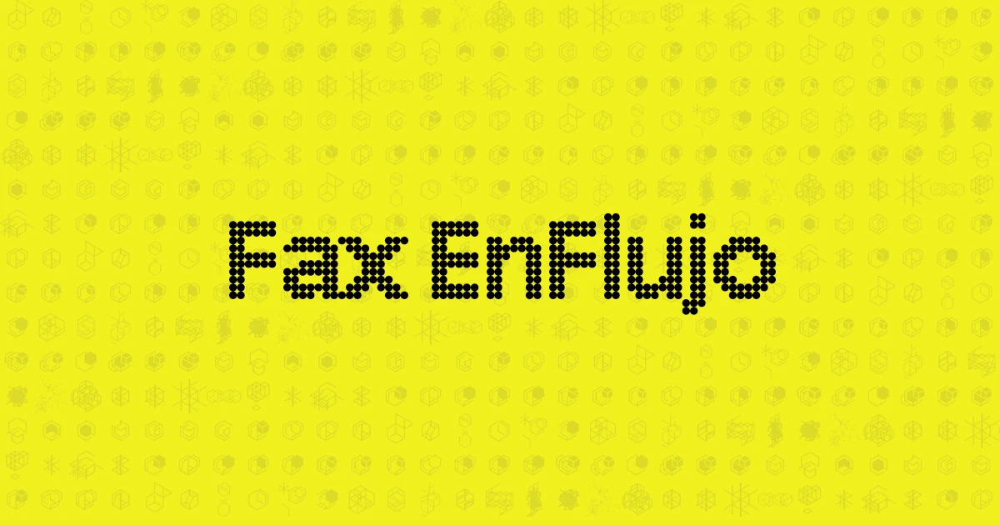

# Fax EnFlujo




## Operación en la Raspberry Pi

Nginx sirve `aplicaciones/cara/publico` en el puerto 4001. PM2 administra dos procesos: `culito` (impresora) y
`camara`.

El proyecto usa Node 24 LTS y Yarn 4. La versión exacta de Yarn está fijada en `package.json` mediante Corepack.

```sh
corepack enable
yarn install --immutable
```

Antes de desplegar, comprobar tipos, formato y compilación:

```sh
yarn revisar
yarn armar
```

```sh
yarn reiniciar
pm2 save
```

Antes de la primera ejecución de esta versión hay que detener cualquier copia antigua de `camara.py` que ya esté
ocupando el puerto 4003. A partir de ahí PM2 reinicia la cámara si deja de entregar cuadros durante 15 segundos.

Comprobaciones rápidas:

```sh
pm2 status
pm2 logs camara --lines 100
curl http://127.0.0.1:4003/health
curl --output /tmp/fax-camara.jpg http://127.0.0.1:4003/snapshot.jpg
```

`/health` debe responder con `"ok": true`. El MJPEG de `/stream.mjpg` permanece abierto mientras la cámara entregue
cuadros; el navegador se reconecta automáticamente si la cámara o el proxy cierran la conexión.
